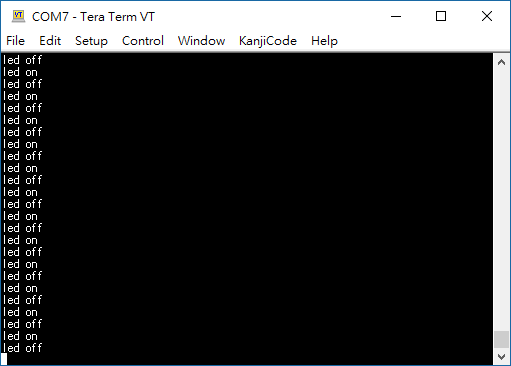

# lpc1114_duignan
a small development kit base on gun gcc for NXP LPC1114

base on a project form https://batchloaf.wordpress.com/2013/11/29/simple-arm-example-for-lpc1114/

and then to add uart feature

Usage:
  1. using build.bat to build the project,
   will output main.hex in the out folder.

  2. using flash magic utility to burn main.hex into lpc111x mcu's flash
  3. open Terminal (for example, Tera Term or Putty) and set baut rate to 38400
  4. reset lpc111x mcu,
  5. the Terminal should display 'led on, led off, ...'

Notes:
  For detail operation, please reference the link above.

Screenshot
  
  
